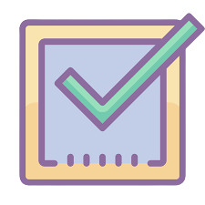

# AppTasks

Welcome to AppTasks! This Angular application helps you manage your tasks efficiently. Here's how you can use it:

- **Login**: Use the credentials below to log in and access your tasks. Upon successful login, you'll be directed to the "Tasks" page.
    - **User**: test01
    - **Password**: test01

- **Add Tasks**: Add new tasks to your list. Simply enter a task and press "Enter" or click the "Add" button.

- **Manage Tasks**: Check off tasks when completed, and delete tasks when no longer needed. Deleting a task is only possible when the checkbox is unchecked.

🎉 **Feel free to explore and enhance your productivity with AppTasks!** 🎉

## Demo

Check out the live demo [here](https://task-list-luva.netlify.app).

## Technology Stack 👩🏻‍💻

- Angular and TypeScript: Frontend framework and programming language.
- Bootstrap: CSS framework for styling.
- NgRX 🎉: State management library for Angular applications.
- Jasmine and Karma: Testing frameworks for unit and integration tests.
